```{r}
#| label: setup-summary
#| include: false
# This page reports the values and figures that appear in the main text.
# It does NOT re-run the analysis pipeline: estimates are transcribed from the
# frozen model outputs reported in the manuscript, and the figures are the same
# files generated by the detailed chapters of this book. Uses only base R +
# knitr::kable, so it renders with no additional dependencies.
knitr::opts_chunk$set(echo = TRUE, message = FALSE, warning = FALSE)
tbl <- function(df, cap) knitr::kable(df, caption = cap, align = "l")
```

::: callout-note
## What this page is

A **concise overview** of the study's headline results. It reproduces only the numbers,
tables, and figures that the main text actually reports, section by section,
with a sentence or two of plain-language context for each — for readers and
reviewers who want the headline evidence without the full computational trail.

The complete, fully reproducible workflow (data loading, model code, saved model
objects, and every diagnostic) is in the other chapters of this book; use the
sidebar to navigate to any step. Figures here are the same files those chapters
generate; estimates are transcribed from the reported model outputs. Code blocks
are folded — click **"Show R code"** to see how each summary table is assembled.
:::

# Screening outcomes and dataset

We added **69 new effect sizes from 29 studies**, spanning **15 species**.
Notably, 13 of the new studies (45%) were published in or before 2019, inside
the search window of the original meta-analyses. Two of those thirteen were
already in the dataset of Davies et al. (2020) — recovered independently by our
search and re-extracted from the primary reports — leaving **eleven (38%)** that
fell inside that window yet appeared in neither original synthesis. Six (20.7%)
of the new studies were unpublished theses, reflecting the value of the
multilingual and grey-literature search. Two model genera dominate the evidence: *Drosophila* (11 studies) and
*Poecilia* (8 studies) together contribute 46 effect sizes (66%). When pooled
with the two original datasets, the combined sample covers **33 species**.

Because the two source datasets overlap in the primary studies they cover, the
40 studies carried over from Jones & DuVal (2019), the 58 from Davies et
al. (2020) and the 29 added here do not sum to a count of unique studies.
Resolving all three sources to distinct publications gives **94 unique primary
studies**: 30 are common to the two source datasets, two of our new studies were
already in Davies et al., and one Jones & DuVal study code duplicates another in
the same dataset. The [extraction-validation
chapter](scripts/3_original_dataset_crosscheck/extraction_validation.qmd#sec-unique-studies)
sets out the full study-level crosswalk and every accepted and rejected match.

```{r}
#| label: tbl-dataset
dataset <- data.frame(
  Quantity = c("New effect sizes", "New studies", "Species (new extraction)",
               "Studies published ≤2019",
               "…of those, in neither original synthesis",
               "Unpublished theses",
               "Effect sizes from Drosophila + Poecilia", "Species (combined dataset)",
               "Unique primary studies (all three sources)",
               "Studies shared by the two source datasets"),
  Value = c("69", "29", "15", "13 (45%)", "11 (38%)", "6 (20.7%)", "46 (66%)", "33",
            "94", "30")
)
tbl(dataset, "Table 1. Key descriptors of the updated dataset.")
```

::: {layout-ncol=2}
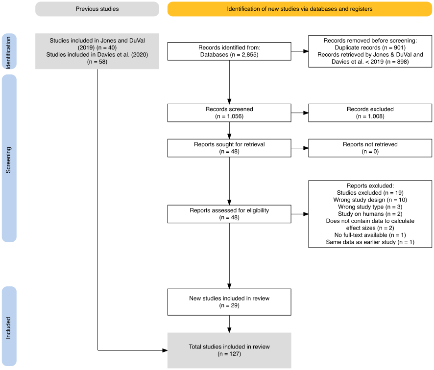{#fig-prisma}

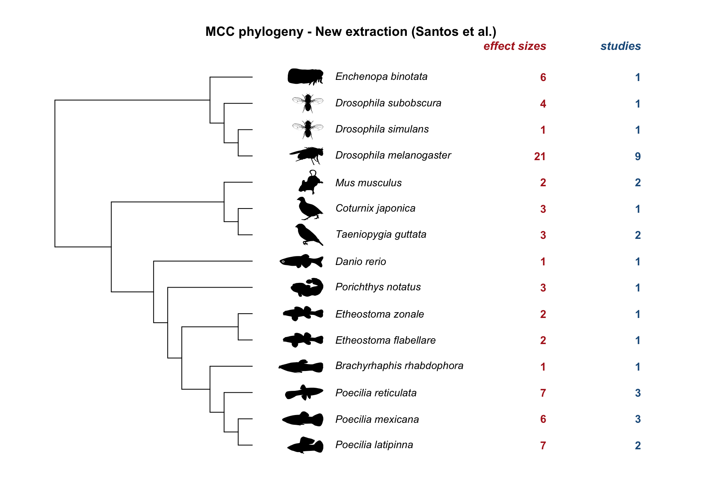{#fig-phylo}
:::

# Overall evidence for mate-choice copying

The pooled effect of social information stayed **positive and significant on
both scales** in the combined data, but was **appreciably smaller than the
original estimates**. Considered on its own, the new evidence was roughly half
the original magnitude, with confidence intervals spanning the null.

```{r}
#| label: tbl-overall
overall <- data.frame(
  Scale = c("Odds ratio (OR)", "Odds ratio (OR)", "Odds ratio (OR)",
            "Hedges' g / d", "Hedges' g / d", "Hedges' g / d"),
  Dataset = c("Original (Jones & DuVal 2019)", "New (this study)", "Combined",
              "Original (Davies et al. 2020)", "New (this study)", "Combined"),
  Estimate = c("2.71", "1.46", "1.81", "0.58", "0.21", "0.45"),
  `95% interval` = c("1.60 to 4.80", "0.97 to 2.20", "1.35 to 2.42",
                     "0.34 to 0.83", "-0.02 to 0.43", "0.24 to 0.65"),
  Note = c("posterior CrI", "spans null", "significant",
           "reported as d", "spans null", "significant"),
  check.names = FALSE
)
tbl(overall, "Table 2. Overall meta-analytic mean on each scale, for the original, new, and combined datasets.")
```

::: {layout-ncol=2}
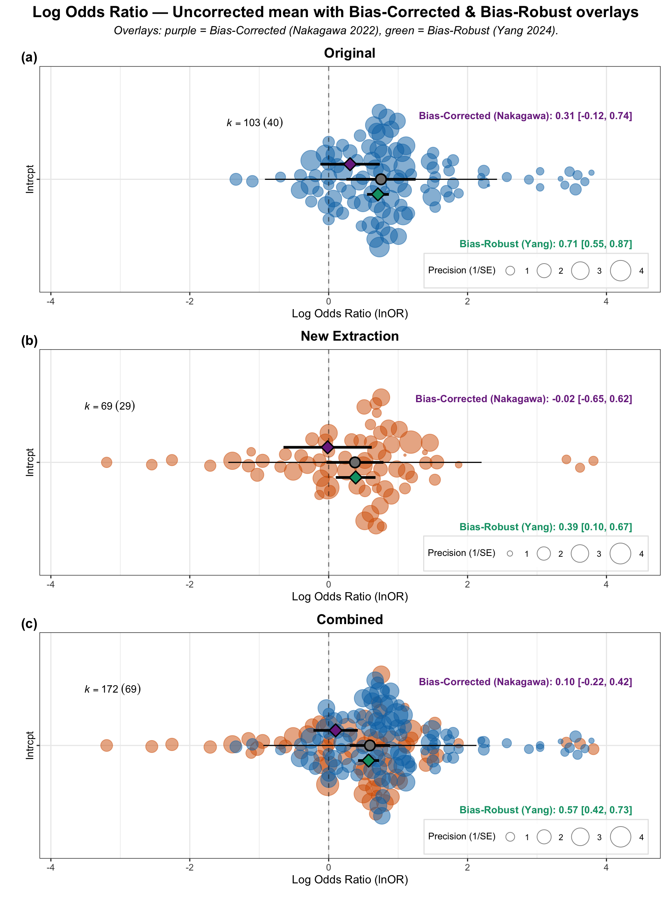{#fig-or}

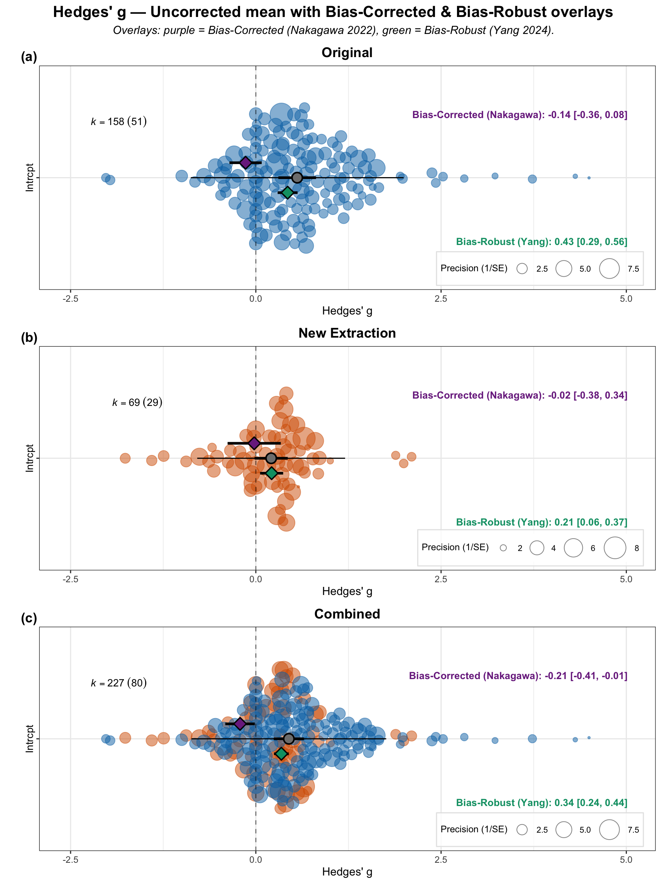{#fig-hedges}
:::

## Heterogeneity

Total heterogeneity was high in every model ($I^2 > 74\%$). It accumulated
mainly **within studies** (residual, effect-size level) and **among species**,
not *between* studies, which contributed little (< 8%). Phylogenetic signal was
negligible ($I^2 < 7\%$).

```{r}
#| label: tbl-i2
i2 <- data.frame(
  Analysis = c("Hedges' g — New only", "Hedges' g — Original only", "Hedges' g — Combined",
               "Log OR — New only", "Log OR — Original only", "Log OR — Combined"),
  Total    = c(80.8, 86.0, 85.7, 80.8, 75.9, 74.7),
  Study     = c(0.0, 1.2, 7.4, 0.0, 0.0, 4.3),
  `Effect size (residual)` = c(51.3, 79.4, 71.7, 51.3, 23.2, 45.4),
  `Species (non-phylo.)`   = c(29.4, 0.0, 3.1, 29.5, 45.6, 23.9),
  Phylogeny = c(0.0, 5.4, 3.5, 0.0, 7.1, 1.1),
  check.names = FALSE
)
tbl(i2, "Table 3. Partial I² (%) by random effect across the uncorrected multilevel models.")
```

# Taxonomic group

All group means were positive on both scales. On the Hedges' g scale the point
estimates rose from arthropods to fish to other vertebrates, and the among-group
test only approached significance; on the log-odds scale the ranking differed
and the groups did not differ significantly.

```{r}
#| label: tbl-taxon
taxon <- data.frame(
  Scale = c("Hedges' g", "Hedges' g", "Hedges' g",
            "Log OR", "Log OR", "Log OR"),
  Group = c("Arthropods", "Fish", "Other vertebrates (birds, mammals)",
            "Fish", "Other vertebrates (birds, mammals)", "Arthropods"),
  Estimate = c("0.24", "0.49", "0.71", "0.82", "0.61", "0.33"),
  `95% CI` = c("0.01 to 0.46", "0.28 to 0.69", "0.36 to 1.07",
               "0.37 to 1.26", "-0.04 to 1.25", "-0.13 to 0.80"),
  check.names = FALSE
)
tbl(taxon, "Table 4. Uni-moderator estimates by taxonomic group (combined datasets).")
```

Among-group tests: Hedges' g, $F_{2,27} = 3.00$, *p* = 0.066 (total $I^2$ =
94.3%); log OR, $F_{2,25} = 1.17$, *p* = 0.327 (total $I^2$ = 89.5%). These
models are fitted with `test = "t"`, so the omnibus test is an $F$-statistic with
containment degrees of freedom rather than a Wald $Q_M$ chi-square.

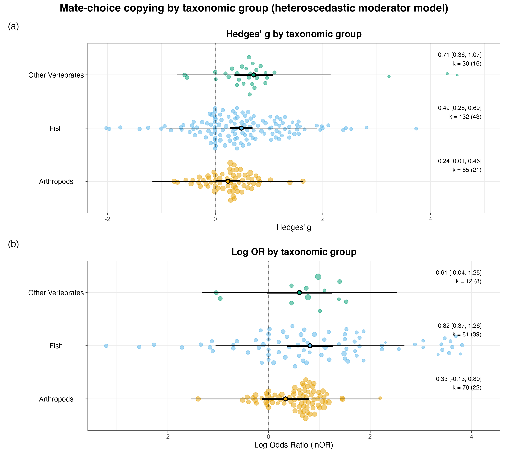{#fig-taxon}

# Exploratory (non-pre-registered) moderators

Beyond taxonomic group we examined observer sex, copying mechanism, cue
modality, and observer mating status; demonstrator age showed no variation in the
new extraction and could not be analysed. These were exploratory, several levels
are sparsely sampled, and **no moderator explained a detectable share of the
heterogeneity** (all omnibus $F$-tests, *p* $\geq$ 0.17; total $I^2$ stayed above
80%). Three contrasts are worth noting.

```{r}
#| label: tbl-mods
mods <- data.frame(
  Contrast = c("Copying mechanism (combined, Hedges' g)",
               "Copying mechanism (new, Hedges' g)",
               "Observer status (new, Hedges' g)",
               "Observer status (combined, OR)",
               "Observer sex (new, Hedges' g)"),
  Comparison = c("generalized 0.43 vs individual 0.46",
                 "generalized 0.26 vs individual 0.16",
                 "virgin 0.09 vs non-virgin 0.36",
                 "virgin 1.75 vs non-virgin 1.91",
                 "male 0.51 vs female 0.16"),
  Test = c("F(1, 225) = 0.05, p = 0.82",
           "F(1, 27) = 0.31, p = 0.58",
           "F(1, 27) = 1.61, p = 0.22",
           "F(1, 170) = 0.13, p = 0.72",
           "F(1, 67) = 1.95, p = 0.17")
)
tbl(mods, "Table 5. Selected exploratory moderator contrasts. None was statistically distinct.")
```

Generalized and individual copying were statistically indistinguishable:
essentially identical in the combined data, and in the new extraction the
generalized estimate was, if anything, marginally larger. Unlike Jones & DuVal
(2019), the new extraction did **not** reproduce stronger copying among virgin
observers — it tended to reverse it — and the difference vanished once pooled
with the original binary data. Male observers copied at least as strongly as
females, though with only 8 effect sizes from 5 studies at the male level this is
a weak test: it is better read as no evidence of a sex difference than as
evidence the sexes are alike. Full model summaries and orchard plots for every
moderator are in the **Overall Effect** and **Moderator** chapters (see
sidebar).

# Small-study effects, time-lag, and sensitivity

We found **strong small-study effects on both scales** and **a time-lag decline
only for the binary outcomes**. Under the more conservative correction the
adjusted mean approached zero — and for Hedges' g fell significantly below it —
whereas the bias-robust estimator kept a positive but reduced effect.

```{r}
#| label: tbl-eggers
eggers <- data.frame(
  Scale = c("Odds ratio", "Hedges' g"),
  `Egger slope (√v_i)` = c("2.11 (1.23 to 2.99)", "4.36 (3.22 to 5.49)"),
  `Time-lag slope (year)` = c("-0.028 (-0.048 to -0.007)", "-0.002 (-0.014 to 0.01)"),
  `Time-lag?` = c("yes (declining)", "no"),
  check.names = FALSE
)
tbl(eggers, "Table 6. Small-study (Egger-type) and time-lag slopes on the combined data.")
```

```{r}
#| label: tbl-corrections
corr <- data.frame(
  Scale = c("Hedges' g", "Hedges' g", "Hedges' g",
            "Log OR (OR)", "Log OR (OR)", "Log OR (OR)"),
  Estimator = c("Uncorrected", "Bias-corrected (Nakagawa)", "Bias-robust (Yang)",
                "Uncorrected", "Bias-corrected (Nakagawa)", "Bias-robust (Yang)"),
  Mean = c("0.45", "-0.21", "0.34",
           "0.59 (OR 1.81)", "0.10 (OR 1.11)", "0.57 (OR 1.77)"),
  `95% CI` = c("0.24 to 0.65", "-0.41 to -0.01", "0.24 to 0.44",
               "0.30 to 0.89", "-0.22 to 0.42", "0.42 to 0.73"),
  check.names = FALSE
)
tbl(corr, "Table 7. Uncorrected vs. the two publication-bias-corrected means (combined data).")
```

::: {layout-ncol=2}
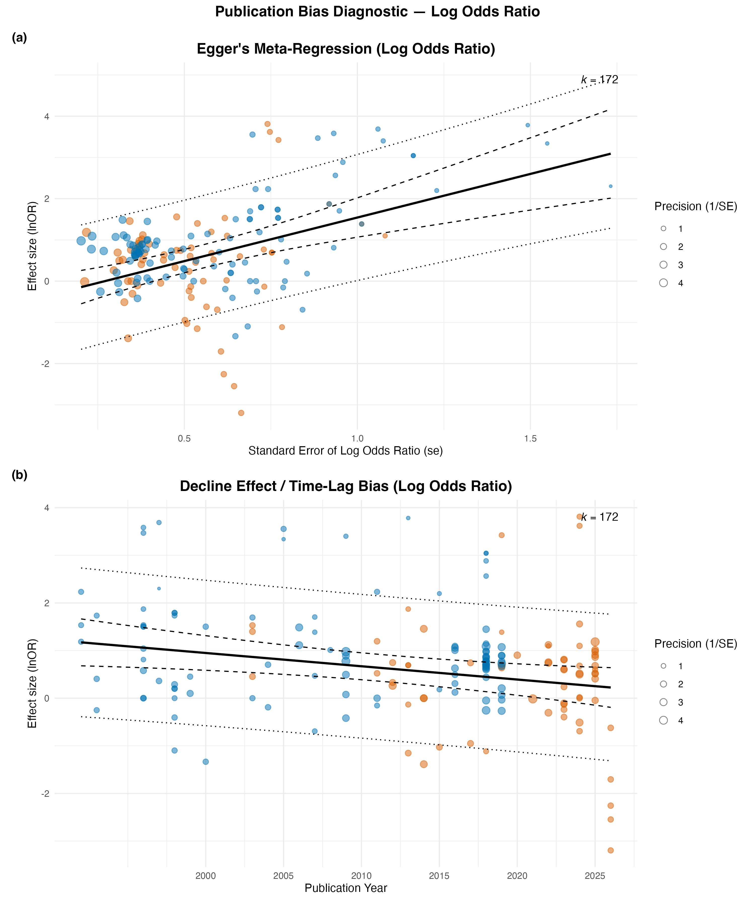{#fig-egor}

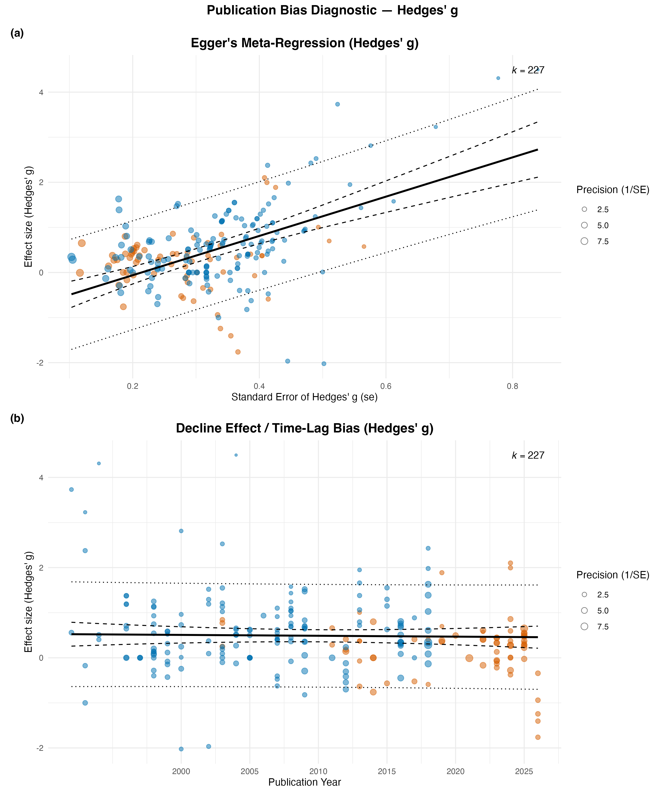{#fig-eghedges}
:::

::: {layout-ncol=2}
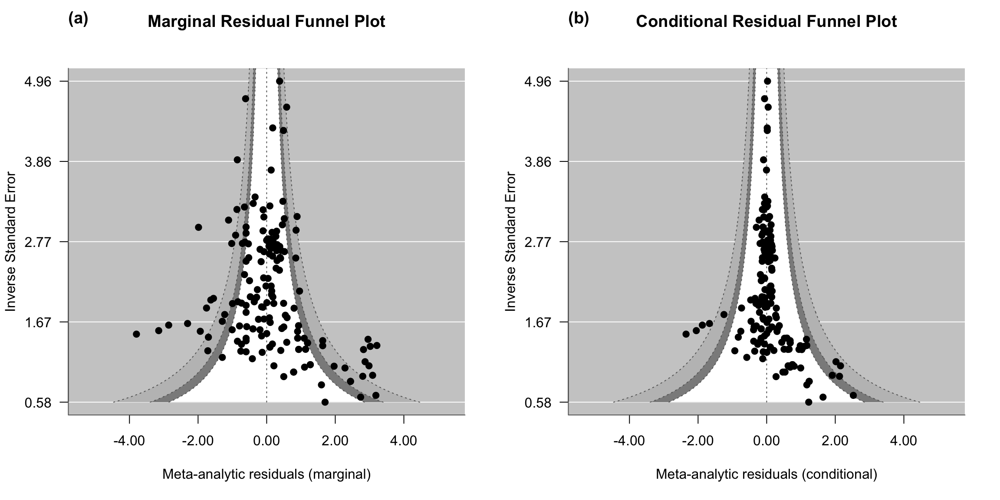{#fig-funor}

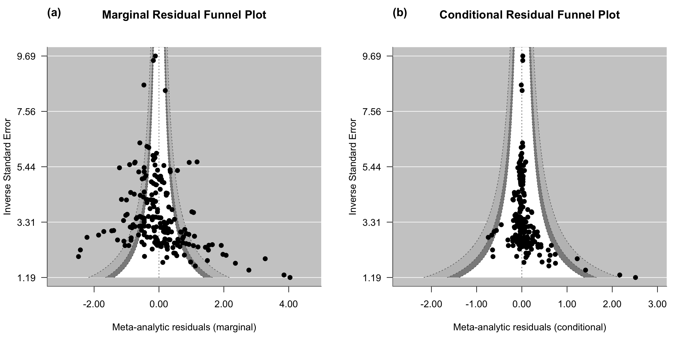{#fig-funhedges}
:::

## Robustness: leave-one-out and contentious effect sizes

The pooled estimates were **robust**. In leave-one-study-out and
leave-one-species-out analyses every interval overlapped the full-sample
estimate; the largest shift in any pooled mean was **≤ 0.07 units** (0.02 g /
0.04 log-OR leaving out studies; 0.04 g / 0.07 log-OR leaving out species).
Removing *Poecilia reticulata* — the strongest-copying, most-sampled species —
nudged the mean toward zero but changed neither sign nor significance.

```{r}
#| label: tbl-sensitivity
sens <- data.frame(
  Scale = c("Hedges' g", "Hedges' g", "Hedges' g",
            "Odds ratio", "Odds ratio", "Odds ratio"),
  Version = c("Main", "Leave-out (7 flagged studies)", "Corrected",
              "Main", "Leave-out (7 flagged studies)", "Corrected"),
  Mean = c("0.44", "0.42", "0.42", "1.81", "1.77", "1.79"),
  `95% CI` = c("0.24 to 0.65", "0.22 to 0.61", "0.23 to 0.62",
               "1.35 to 2.42", "1.32 to 2.38", "1.36 to 2.34"),
  k = c("227", "213", "225", "172", "156", "169"),
  check.names = FALSE
)
tbl(sens, "Table 8. Sensitivity of the combined means to the seven contentious cross-dataset studies.")
```

::: {layout-ncol=2}
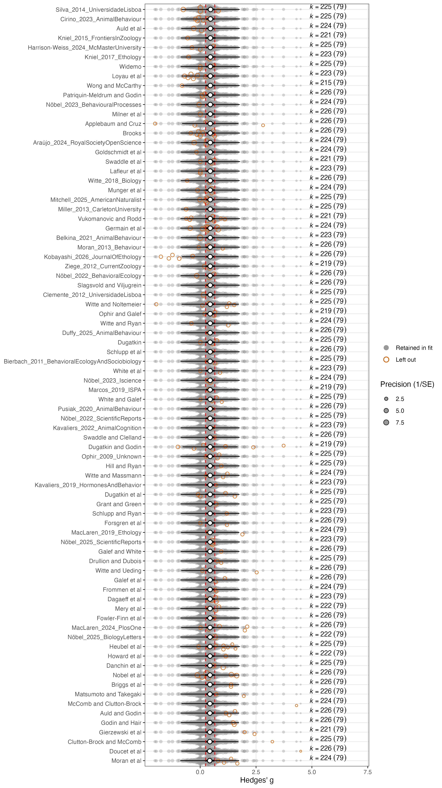{#fig-loostudyh}

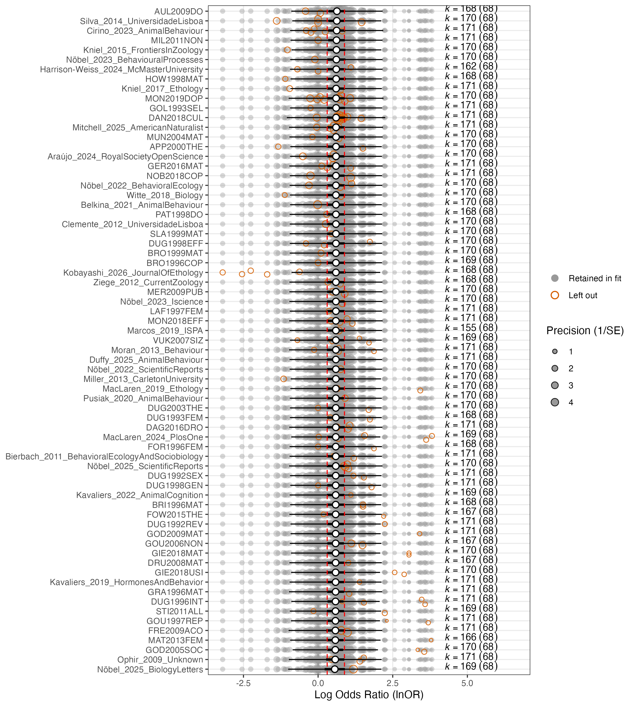{#fig-loostudyor}
:::

::: {layout-ncol=2}
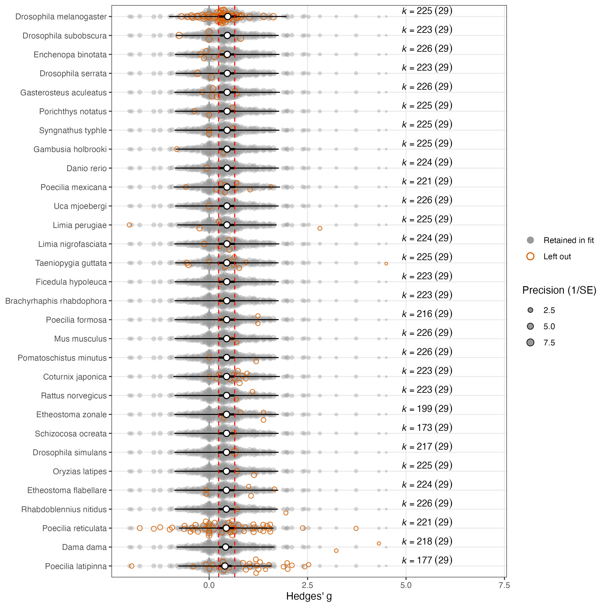{#fig-loospeciesh}

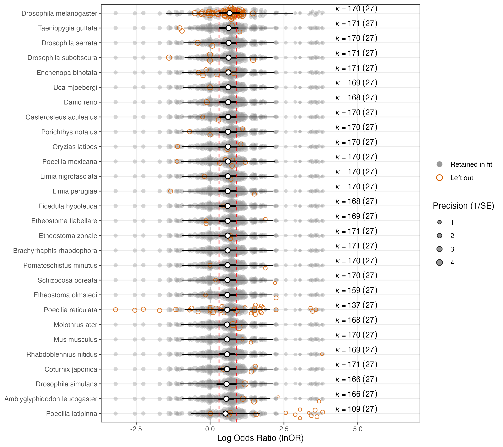{#fig-loospeciesor}
:::

::: {layout-ncol=2}
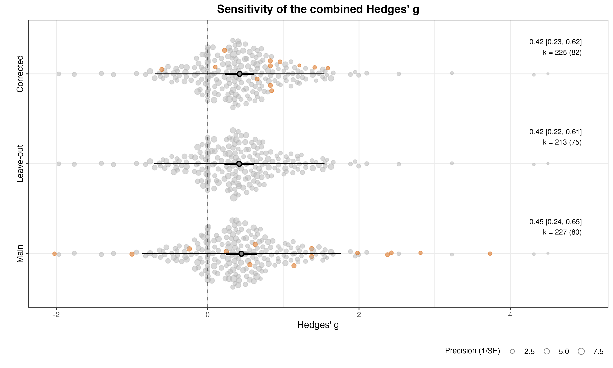{#fig-senshedges}

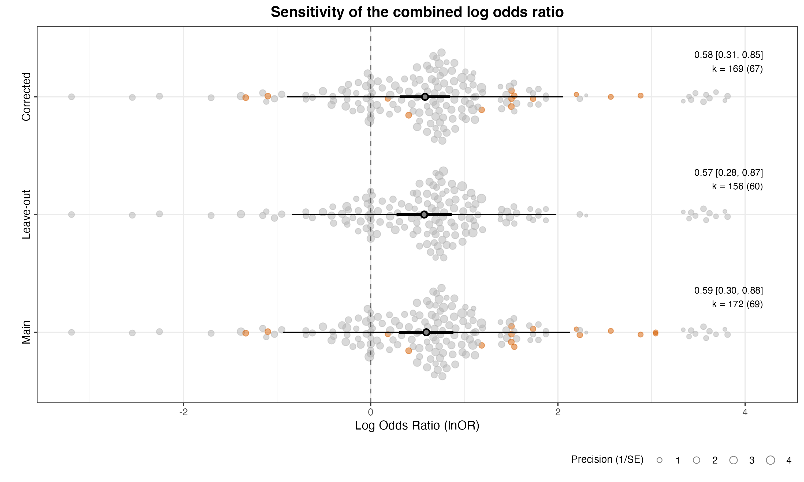{#fig-sensor}
:::

# Bottom line

The qualitative conclusion of both original syntheses survives an expanded, more
rigorous update: animals do copy the mate choices of others, and the pooled
effect is positive and significant on both scales. But the effect is **more
modest and more context-dependent** than previously implied — roughly half the
original magnitude on its own, surrounded by large heterogeneity, and drawn
close to (or below) zero under the more conservative bias correction.
